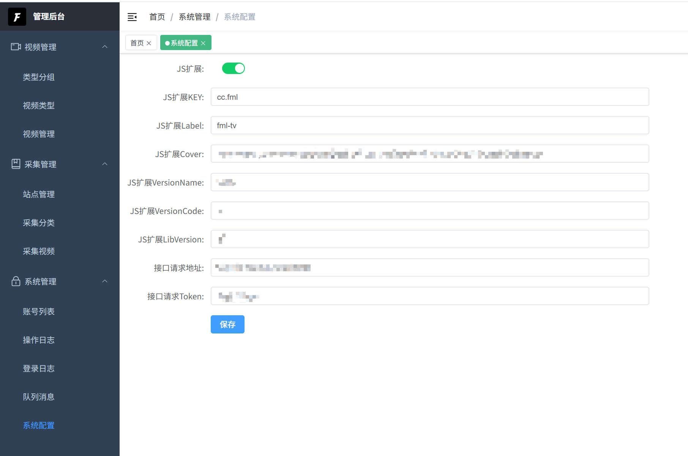

# FML-TV-API

> 本项目为聚合采集站API, 管理页面见[fml-tv-admin](https://github.com/CodingZx/fml-tv-admin)项目

### 注意：部署后项目为空壳项目，无内置源，需要自行收集

## 技术栈

| 分类    | 主要依赖                                                                                                  |
|-------|-------------------------------------------------------------------------------------------------------|
| Web框架 | [Actix-Web](https://actix.rs/)                            |
| ORM   |   [SeaORM](https://www.sea-ql.org/SeaORM/)                            |
| 数据库   | Postgresql                                                                                            |
| 语言    | Rust                                                                                                  |
| 部署    | Docker                                                                                                |


## 环境变量

| 变量                          | 说明                 | 变量类型 | 默认值       |
|-----------------------------|--------------------|------|-----------|
| APP_PROFILE                 | Profile            | 字符串  | dev       |
| SERVER_PORT                 | 启动端口号              | 数字   | 18099     |
| DB_HOST                     | 数据库地址              | 字符串  | localhost |
| DB_PORT                     | 数据库端口号             | 数字   | 5432      |
| DB_NAME                     | 数据库名称              | 字符串  | fml-tv    |
| DB_USERNAME                 | 数据库账号              | 字符串  | postgres  |
| DB_PASSWORD                 | 数据库密码              | 字符串  | postgres  |
| DB_SCHEMA                   | 数据库Schema          | 字符串  | public    |
| DB_POOL_MIN_CONN            | 数据库连接池 最小连接数       | 数字   | 1         |
| DB_POOL_MAX_CONN            | 数据库连接池 最大连接数       | 数字   | 10        |
| DB_POOL_CONN_TIMEOUT_SEC    | 数据库连接池 连接超时时间(秒)   | 数字   | 10        |
| DB_POOL_ACQ_TIMEOUT_SEC     | 数据库连接池 获取连接超时时间(秒) | 数字   | 10        |
| DB_POOL_IDLE_TIMEOUT_SEC    | 数据库连接池 闲置连接时间(秒)   | 数字   | 30        |
| DB_POOL_MAX_LIFE_TIME_SEC   | 数据库连接池 最大存活时间(秒)   | 数字   | 3600      |
| DB_SQLX_LOGGING             | 数据库 是否开启SQLX日志     | 布尔值  | false     |
| DB_SQLX_LOGGING_LEVEL       | 数据库 SQLX日志级别       | 字符串  | off       |
| PGQ_ENABLE                  | 队列是否启动             | 布尔值  | true      |
| PGQ_FETCH_INTERVAL_MS       | 队列拉取间隔(毫秒)         | 数字   | 5000      |
| PGQ_DELAY_FETCH_INTERVAL_MS | 延迟队列拉取间隔(毫秒)       | 数字   | 5000      |
| PGQ_AUTO_CLEAN              | 队列自动清理             | 布尔值  | true      |

DB_SQLX_LOGGING_LEVEL变量值:
- off
- trace
- debug
- info
- warn
- error

PGQ为消息队列组件, 完全由Postgresql实现, 定时采集任务依赖消息队列, 如果是本地调试其他功能可关闭

PGQ_AUTO_CLEAN为true时, 消息消费完毕会从数据库中delete, 建议开启postgresql的auto vacuum


## 客户端
本项目可配合 [纯纯看番](https://github.com/easybangumiorg/EasyBangumi) 使用, 使用说明见下文

## 安全与隐私提醒

### 请设置密码保护并关闭公网注册

为了您的安全和避免潜在的法律风险，我们要求在部署时**强烈建议关闭公网注册**：

### 部署要求
1. **仅供个人使用**：请勿将您的实例链接公开分享或传播
2. **遵守当地法律**：请确保您的使用行为符合当地法律法规

### 重要声明

- 本项目仅供学习和个人使用
- 请勿将部署的实例用于商业用途或公开服务
- 如因公开分享导致的任何法律问题，用户需自行承担责任
- 项目开发者不对用户的使用行为承担任何法律责任
- 本项目不在中国大陆地区提供服务。如有该项目在向中国大陆地区提供服务，属个人行为。在该地区使用所产生的法律风险及责任，属于用户个人行为，与本项目无关，须自行承担全部责任。特此声明


## 使用说明
> 项目仅依赖Postgresql, 请先准备好PG实例并创建好数据库及账号密码
### 数据库
使用[init/init.sql](init/init.sql)脚本初始化数据库

**初始账号**为admin, 初始密码为fml@2026

### 配置启动项
1. 使用配置文件
    - 项目启动时先读取环境变量APP_PROFILE, 默认值为dev
    - 读取conf/app-{profile}.yml的配置(示例见[conf/app-dev.yml](conf/app-dev.yml))
2. 使用环境变量
    - 见环境变量说明

混合使用时**环境变量**优先级大于**配置文件**, 都配置的情况下会使用环境变量的值

### Docker启动
本项目已制作Docker镜像
```
docker run -d --name fml-tv-api \ 
    -e SERVER_PORT=18099 \
    -e DB_HOST=127.0.0.1 \
    -e DB_NAME=fml-tv \
    -e DB_USERNAME=postgres \
    -e DB_PASSWORD=postgres \
    -e DB_PASSWORD=postgres \
    -p 18099:18099 \
    fmlcc/fml-tv-api:1.0.0
```
请自行修改配置

### 纯纯看番添加扩展
> 假设部署后访问地址为: http://192.168.1.1:18099
1. 在管理页面中的系统管理-系统配置下修改内容
   - 保证JS扩展开启
   - 填写接口请求地址(即app可直接访问此项目的地址), 示例: http://192.168.1.1:18099
   - 可选: 修改请求Token
   - 其他参数为生成纯纯看番JS扩展的说明, 可不修改


2. 打开纯纯看番 - 更多 - 番源管理 - 扩展 - 右上角+ - 手动添加
   - 填入 http://192.168.1.1:18099/expose/fml.js 即可
   - 可选: 如果配置的分类过多, 可通过指定参数来添加需要的分类, 示例: http://192.168.1.1:18099/expose/fml.js?types=番剧,电影
   - 请注意使用英文逗号分割
3. 建议使用纯纯看番5.5.8版本, 已通过测试